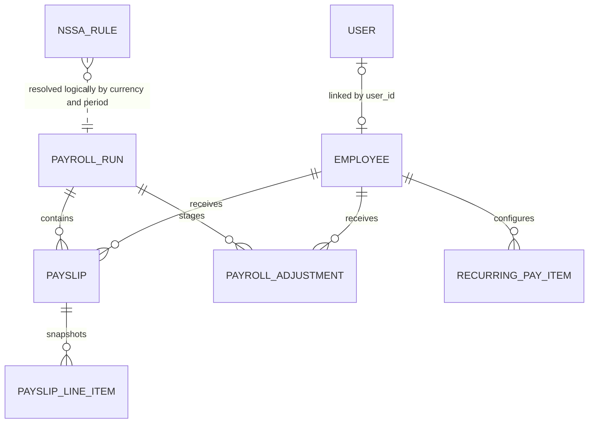

# Payroll Lite API
 
Payroll Lite API is a RESTful payroll-management backend built with Spring Boot and PostgreSQL. It currently supports account authentication, role-based access, employee records, multi-currency payroll runs, Zimbabwe-style NSSA and PAYE calculation, one-off and fixed recurring pay items, and employee self-service payslips.

This repository is an active learning project, but its structure and documentation are intended to be understandable to both junior and senior developers.

> **Project status:** Active development. NSSA, progressive PAYE, one-off adjustments, and effective-dated fixed recurring earnings/deductions are implemented. Employee-specific tax credits are planned.

## Table of contents

- [What the API does](#what-the-api-does)
- [Technology stack](#technology-stack)
- [Architecture](#architecture)
- [Domain and business rules](#domain-and-business-rules)
- [Prerequisites](#prerequisites)
- [Quick start](#quick-start)
- [Configuration](#configuration)
- [Bootstrap the first administrator](#bootstrap-the-first-administrator)
- [Authentication and authorization](#authentication-and-authorization)
- [API reference](#api-reference)
- [Common request examples](#common-request-examples)
- [Response contracts](#response-contracts)
- [Errors and status codes](#errors-and-status-codes)
- [Database and persistence](#database-and-persistence)
- [Testing](#testing)
- [Troubleshooting](#troubleshooting)
- [Known limitations](#known-limitations)
- [Production checklist](#production-checklist)
- [Roadmap](#roadmap)

## What the API does

The current API provides:

- Public account registration and JWT login.
- `ADMIN`, `HR`, and `EMPLOYEE` roles.
- Automatic linking between a user account and an employee record when their normalized email addresses match.
- Backend-generated employee numbers such as `EMP-000001`.
- Employee creation, retrieval, update, and deletion.
- USD and ZWG salary currencies.
- Effective-dated NSSA rules managed by Admin or HR users.
- Payroll runs grouped by month, year, and currency.
- NSSA contribution calculation with an earnings ceiling.
- Effective-dated monthly PAYE tables with progressive bands, tax credits, and AIDS levy calculation.
- Admin/HR endpoints and UI support for managing PAYE tables without direct database access.
- One-off taxable or non-taxable earnings and after-tax deductions on draft payroll runs.
- Fixed recurring employee earnings and deductions with effective dates and active-state management.
- Immutable salary and statutory snapshots on generated payslips.
- Employee access to only their own payslips.
- OpenAPI documentation through Swagger UI.

## Technology stack

| Area | Technology |
|---|---|
| Language | Java 21 |
| Framework | Spring Boot 4.1.0 |
| HTTP | Spring Web MVC |
| Persistence | Spring Data JPA and Hibernate |
| Database | PostgreSQL |
| Security | Spring Security and stateless JWT |
| JWT library | JJWT 0.12.6 |
| Validation | Jakarta Bean Validation |
| API documentation | springdoc-openapi / Swagger UI |
| Build | Maven Wrapper 3.3.4 / Maven 3.9.16 |
| Boilerplate reduction | Lombok 1.18.42 |
| Testing | JUnit and Mockito through Spring Boot test starters |

## Architecture

Payroll Lite uses a conventional layered architecture:

```text
HTTP request
    |
    v
Controller  -> request validation and HTTP response codes
    |
    v
Service     -> transactions and business rules
    |
    +------> Calculation components
    |
    v
Repository  -> Spring Data JPA
    |
    v
PostgreSQL
```

Main source layout:

```text
src/main/java/com/tino/payroll/lite/
|-- config/             Security and password configuration
|-- controller/         REST endpoints
|-- dto/                API request and response contracts
|-- entity/             JPA domain entities
|-- enums/              Roles, currencies, and statuses
|-- exception/          Domain exceptions and global error handling
|-- repository/         Spring Data repositories
|-- service/            Application and domain services
|   `-- calculation/    NSSA/PAYE rule resolution and pure calculations
`-- utlil/              JWT authentication filter
```

> The directory name `utlil` is currently misspelled in the codebase; it contains the JWT filter.

The domain relationships are:



`NSSA_RULE` is not stored as a direct foreign key on `PAYROLL_RUN`. Instead, processing resolves the applicable rule and copies its version and calculated values into each payslip. This preserves the historical result even if statutory settings change later.

## Domain and business rules

### Users and employees

`User` and `Employee` represent different concerns:

- A user is a login identity with credentials, a role, and an enabled flag.
- An employee is an employment record containing salary, currency, status, and hire details.
- A person may have both records, linked one-to-one through `employees.user_id`.
- Email is normalized to lowercase and is the matching key used during account harmonization.

The two supported creation paths are:

1. **Employee exists first:** HR creates the employee. When that person registers with the same email, registration links the new user to the employee.
2. **User exists first:** The person registers. When HR later creates an employee with the same email, employee creation links the existing user.

On application startup, the harmonization service also links existing unlinked records that share an email.

Additional rules:

- Public registration always creates an enabled `EMPLOYEE` user.
- A terminated employee cannot claim a public account.
- Terminating a linked employee disables their user account.
- Changing a terminated employee back to another status does not currently re-enable their user account automatically.
- Updating a linked employee synchronizes the user's first name, last name, and email.
- Employee numbers are generated after persistence from the database ID using `EMP-%06d`.
- Employee status values are `ACTIVE`, `ON_LEAVE`, `SUSPENDED`, and `TERMINATED`.

### Payroll and NSSA

A payroll run is unique by month, year, and currency. New runs begin in `DRAFT`.

Processing a draft run performs one database transaction:

1. Load employees whose status is `ACTIVE` and whose salary currency matches the run.
2. Load the run's one-off adjustments and each employee's recurring items that cover the payroll date.
3. Resolve the active NSSA rule and PAYE table that cover the last day of the payroll month.
4. Add all one-off and recurring earnings to gross salary and taxable earnings to PAYE income; keep basic salary as the NSSA pensionable input.
5. Cap pensionable earnings at the rule's ceiling.
6. Calculate employee and employer NSSA contributions.
7. Calculate PAYE from basic salary plus taxable earnings.
8. Add employee NSSA, PAYE, and one-off deductions to total deductions.
9. Save the salary, statutory results, and adjustment line items as a payslip snapshot.
10. Change the run to `PROCESSED` and set `processedAt`.

Current calculation:

```text
pensionable earnings = min(basic salary, NSSA ceiling)
employee NSSA        = pensionable earnings x employee rate
employer NSSA        = pensionable earnings x employer rate
gross salary         = basic salary + all one-off and recurring earnings
taxable income       = basic salary + all taxable earnings
PAYE                 = progressive tax after credits + AIDS levy
total deductions     = employee NSSA + PAYE + one-off and recurring deductions
net salary           = gross salary - total deductions
```

Important processing behavior:

- A processed run cannot be processed again.
- Adjustments can only be added or removed while the run is `DRAFT`.
- An adjustment employee must be active and use the same currency as the run.
- An active recurring item applies when its date range covers the last day of the payroll month; fixed amounts are not prorated.
- Updating or deactivating a recurring template does not change previously generated payslip snapshots.
- If eligible employees exist but no single NSSA rule applies, processing fails with `422 Unprocessable Entity`.
- The transaction prevents partial payslips from being saved when statutory configuration is invalid.
- If no employees are eligible, the run is processed with an empty payslip list and no NSSA rule is required.
- NSSA rule dates are inclusive.
- Active NSSA rule periods for the same currency cannot overlap.
- API rates are decimals: `0.045` means `4.5%`.

Payroll status values currently defined are `DRAFT`, `PROCESSED`, and `CANCELLED`. There is not yet an endpoint that changes a run to `CANCELLED`.

### PAYE foundation

PAYE configuration is modeled separately from payroll orchestration so the calculation can be verified before it affects employee pay:

- `PayeTaxTable` identifies a currency, inclusive effective period, rule version, AIDS levy rate, and active state.
- `PayeTaxBand` stores a lower bound, optional upper bound, and decimal marginal rate.
- Bands use contiguous ranges beginning at zero; only the final band may be open-ended.
- `PayeTaxTableResolver` requires exactly one active table for a currency and payroll date.
- `PayeCalculator` calculates progressive income tax, applies credits without allowing negative tax, and then calculates AIDS levy on tax after credits.

Current standalone calculation sequence:

```text
taxable income
    -> progressive income tax
    -> subtract tax credits (not below zero)
    -> calculate AIDS levy on tax after credits
    -> total PAYE
```

`PayrollService` passes basic salary plus all taxable one-off and recurring earnings as taxable income and currently applies zero employee-specific credits. The resulting tax before credits, credits applied, AIDS levy, total PAYE, and table version are stored on every new payslip. Exemptions, pension deductions, and employee tax credits will be modeled in a later phase.

## Prerequisites

Install or provide:

- Java Development Kit 21.
- PostgreSQL. The current development database has been tested with PostgreSQL 17.
- Git.

A separate Maven installation is optional because the repository includes Maven Wrapper scripts. The first wrapper invocation may require Internet access to download Maven.

Verify Java:

```bash
java -version
```

## Quick start

### 1. Clone the repository

```bash
git clone https://github.com/tinoMukaro/payroll_lite.git payroll-lite-api
cd payroll-lite-api
```

### 2. Create the PostgreSQL database

Using `psql`:

```sql
CREATE DATABASE payroll_lite;
```

Or from a terminal:

```bash
createdb -U postgres payroll_lite
```

### 3. Provide local configuration

Spring Boot environment variables override values in `src/main/resources/application.properties`.

PowerShell:

```powershell
$env:SPRING_DATASOURCE_URL = "jdbc:postgresql://localhost:5432/payroll_lite"
$env:SPRING_DATASOURCE_USERNAME = "postgres"
$env:SPRING_DATASOURCE_PASSWORD = "your-local-postgres-password"
$env:JWT_SECRET = "replace-with-a-random-secret-of-at-least-32-bytes"
$env:JWT_EXPIRATION = "86400000"
```

Bash:

```bash
export SPRING_DATASOURCE_URL="jdbc:postgresql://localhost:5432/payroll_lite"
export SPRING_DATASOURCE_USERNAME="postgres"
export SPRING_DATASOURCE_PASSWORD="your-local-postgres-password"
export JWT_SECRET="replace-with-a-random-secret-of-at-least-32-bytes"
export JWT_EXPIRATION="86400000"
```

### 4. Run the API

Windows PowerShell:

```powershell
./mvnw.cmd spring-boot:run
```

Linux or macOS:

```bash
./mvnw spring-boot:run
```

The API starts at:

- API base URL: `http://localhost:9090/api`
- Swagger UI: `http://localhost:9090/swagger-ui/index.html`
- OpenAPI JSON: `http://localhost:9090/v3/api-docs`

### 5. Package and run the JAR

```bash
./mvnw clean package
java -jar target/payroll.lite-0.0.1-SNAPSHOT.jar
```

## Configuration

| Property | Environment variable | Development default | Purpose |
|---|---|---|---|
| `server.port` | `SERVER_PORT` | `9090` | HTTP port |
| `spring.datasource.url` | `SPRING_DATASOURCE_URL` | Local `payroll_lite` PostgreSQL database | JDBC connection |
| `spring.datasource.username` | `SPRING_DATASOURCE_USERNAME` | `postgres` | Database user |
| `spring.datasource.password` | `SPRING_DATASOURCE_PASSWORD` | Local-only value in properties | Database password |
| `spring.jpa.hibernate.ddl-auto` | `SPRING_JPA_HIBERNATE_DDL_AUTO` | `update` | Development schema synchronization |
| `spring.jpa.show-sql` | `SPRING_JPA_SHOW_SQL` | `true` | Log generated SQL |
| `jwt.secret` | `JWT_SECRET` | Development placeholder | HMAC signing key |
| `jwt.expiration` | `JWT_EXPIRATION` | `86400000` | Token lifetime in milliseconds |

> The credentials and JWT key in `application.properties` are development values. Override them locally and never deploy them to a shared or production environment.

## Bootstrap the first administrator

Public registration deliberately creates only `EMPLOYEE` accounts. A fresh database currently has no automated first-admin seed, and the role-management endpoint already requires an Admin.

For a new **development database only**:

1. Register the first account:

```bash
curl -X POST http://localhost:9090/api/auth/register \
  -H "Content-Type: application/json" \
  -d '{
    "firstName": "System",
    "lastName": "Administrator",
    "email": "admin@example.com",
    "password": "change-me-now"
  }'
```

2. Promote that account once in PostgreSQL:

```sql
UPDATE users
SET role = 'ADMIN'
WHERE email = 'admin@example.com';
```

3. Log in as the administrator. From then on, use `PATCH /api/users/{id}/role` to manage roles.

Do not make public registration capable of assigning privileged roles.

## Authentication and authorization

Authentication is stateless. Login returns a signed JWT and user information:

```bash
curl -X POST http://localhost:9090/api/auth/login \
  -H "Content-Type: application/json" \
  -d '{
    "email": "admin@example.com",
    "password": "change-me-now"
  }'
```

Example response:

```json
{
  "token": "<jwt>",
  "user": {
    "id": 1,
    "firstName": "System",
    "lastName": "Administrator",
    "email": "admin@example.com",
    "role": "ADMIN",
    "enabled": true,
    "employeeId": null
  }
}
```

Send the token on protected requests:

```http
Authorization: Bearer <jwt>
```

The default token lifetime is 24 hours. JWT claims include the email subject, role, user ID, issue time, and expiry time.

### Role matrix

| Capability | ADMIN | HR | EMPLOYEE |
|---|:---:|:---:|:---:|
| Register and log in | Yes | Yes | Yes |
| View own session and payslips | Yes | Yes | Yes |
| Manage employees | Yes | Yes | No |
| Manage recurring and one-off pay items | Yes | Yes | No |
| Manage payroll runs | Yes | Yes | No |
| Manage NSSA rules | Yes | Yes | No |
| Manage PAYE tables | Yes | Yes | No |
| List users | Yes | No | No |
| Change user roles | Yes | No | No |

CORS currently permits browser clients at `http://localhost:5173` and `http://127.0.0.1:5173`.

## API reference

All request and response bodies use JSON unless otherwise stated.

### Authentication

| Method | Endpoint | Access | Success |
|---|---|---|---|
| `POST` | `/api/auth/register` | Public | `201 Created` |
| `POST` | `/api/auth/login` | Public | `200 OK` |
| `GET` | `/api/auth/me` | Authenticated | `200 OK` |

### Employees

| Method | Endpoint | Access | Success |
|---|---|---|---|
| `POST` | `/api/employees` | Admin, HR | `201 Created` |
| `GET` | `/api/employees` | Admin, HR | `200 OK` |
| `GET` | `/api/employees/{id}` | Admin, HR | `200 OK` |
| `PUT` | `/api/employees/{id}` | Admin, HR | `200 OK` |
| `DELETE` | `/api/employees/{id}` | Admin, HR | `204 No Content` |
| `GET` | `/api/employees/{id}/recurring-pay-items` | Admin, HR | `200 OK` |
| `POST` | `/api/employees/{id}/recurring-pay-items` | Admin, HR | `201 Created` |
| `PUT` | `/api/employees/{id}/recurring-pay-items/{payItemId}` | Admin, HR | `200 OK` |

> Employee deletion is currently a **physical delete**, not a soft delete. Existing foreign-key relationships, such as payslips, may prevent deletion.

### Payroll runs and payslips

| Method | Endpoint | Access | Success |
|---|---|---|---|
| `POST` | `/api/payroll-runs` | Admin, HR | `201 Created` |
| `GET` | `/api/payroll-runs` | Admin, HR | `200 OK` |
| `GET` | `/api/payroll-runs/{id}` | Admin, HR | `200 OK` |
| `POST` | `/api/payroll-runs/{id}/process` | Admin, HR | `200 OK` |
| `GET` | `/api/payroll-runs/{id}/payslips` | Admin, HR | `200 OK` |
| `GET` | `/api/payroll-runs/{id}/adjustments` | Admin, HR | `200 OK` |
| `POST` | `/api/payroll-runs/{id}/adjustments` | Admin, HR | `201 Created` |
| `DELETE` | `/api/payroll-runs/{id}/adjustments/{adjustmentId}` | Admin, HR | `204 No Content` |
| `GET` | `/api/payslips/me` | Authenticated | `200 OK` |

`GET /api/payslips/me` derives the user ID from the authenticated principal. A caller cannot supply another employee or user ID.

### NSSA rules

| Method | Endpoint | Access | Success |
|---|---|---|---|
| `GET` | `/api/nssa-rules` | Admin, HR | `200 OK` |
| `POST` | `/api/nssa-rules` | Admin, HR | `201 Created` |
| `PUT` | `/api/nssa-rules/{id}` | Admin, HR | `200 OK` |

There is no delete endpoint. Set `active` to `false` through the update endpoint to prevent a rule from being selected.

### PAYE tax tables

| Method | Endpoint | Access | Success |
|---|---|---|---|
| `GET` | `/api/paye-tax-tables` | Admin, HR | `200 OK` |
| `POST` | `/api/paye-tax-tables` | Admin, HR | `201 Created` |
| `PUT` | `/api/paye-tax-tables/{id}` | Admin, HR | `200 OK` |

PAYE bands use decimal rates, begin at zero, must be contiguous, and require one final open-ended band. Set `active` to `false` to retire a table without deleting it.

### Users

| Method | Endpoint | Access | Success |
|---|---|---|---|
| `GET` | `/api/users` | Admin | `200 OK` |
| `PATCH` | `/api/users/{id}/role` | Admin | `200 OK` |

### Supported enum values

| Type | Values |
|---|---|
| Role | `ADMIN`, `HR`, `EMPLOYEE` |
| Currency | `USD`, `ZWG` |
| Employee status | `ACTIVE`, `ON_LEAVE`, `SUSPENDED`, `TERMINATED` |
| Payroll status | `DRAFT`, `PROCESSED`, `CANCELLED` |

## Common request examples

The following protected examples assume:

```bash
TOKEN="<jwt>"
```

### Create an employee

```bash
curl -X POST http://localhost:9090/api/employees \
  -H "Authorization: Bearer $TOKEN" \
  -H "Content-Type: application/json" \
  -d '{
    "firstName": "Tariro",
    "lastName": "Moyo",
    "email": "tariro.moyo@example.com",
    "jobTitle": "Payroll Officer",
    "basicSalary": 1500.00,
    "salaryCurrency": "USD",
    "hireDate": "2026-07-01",
    "status": "ACTIVE"
  }'
```

The employee number is generated by the backend; clients must not send one.

### Create an NSSA rule

```bash
curl -X POST http://localhost:9090/api/nssa-rules \
  -H "Authorization: Bearer $TOKEN" \
  -H "Content-Type: application/json" \
  -d '{
    "version": "NSSA-USD-2026-EXAMPLE",
    "currency": "USD",
    "effectiveFrom": "2026-01-01",
    "effectiveTo": null,
    "employeeRate": 0.045,
    "employerRate": 0.045,
    "pensionableEarningsCeiling": 1000.00,
    "active": true
  }'
```

> The NSSA values above are illustrative test data, not a statement of the currently applicable statutory ceiling. Confirm rates and ceilings against an official NSSA notice before processing real payroll.

### Create and process a payroll run

Create the draft:

```bash
curl -X POST http://localhost:9090/api/payroll-runs \
  -H "Authorization: Bearer $TOKEN" \
  -H "Content-Type: application/json" \
  -d '{
    "month": 7,
    "year": 2026,
    "currency": "USD"
  }'
```

Process run `1`:

```bash
curl -X POST http://localhost:9090/api/payroll-runs/1/process \
  -H "Authorization: Bearer $TOKEN"
```

Processing is a final state in the current API, so review the period, currency, employee salaries, and NSSA configuration first.

### View the authenticated user's payslips

```bash
curl http://localhost:9090/api/payslips/me \
  -H "Authorization: Bearer $TOKEN"
```

### Change a user's role

```bash
curl -X PATCH http://localhost:9090/api/users/2/role \
  -H "Authorization: Bearer $TOKEN" \
  -H "Content-Type: application/json" \
  -d '{"role": "HR"}'
```

### Request field summary

| Request | Required fields |
|---|---|
| Registration | `firstName`, `lastName`, valid `email`, `password` of at least 8 characters |
| Login | Valid `email`, `password` |
| Employee create/update | `firstName`, `lastName`, valid `email`, `jobTitle`, positive `basicSalary`, `salaryCurrency`, present/past `hireDate`; `status` is optional |
| Payroll-run create | `month` from 1-12, `year` of at least 2000, `currency` |
| NSSA rule create/update | Unique `version`, `currency`, `effectiveFrom`, decimal rates from 0-1, positive ceiling, `active`; `effectiveTo` is optional |
| PAYE table create/update | Unique `version`, `currency`, effective dates, decimal AIDS levy, `active`, and contiguous progressive `bands` ending open-ended |
| Payroll adjustment create | Eligible `employeeId`, `EARNING` or `DEDUCTION`, description, positive amount with at most two decimals, and optional taxable flag for earnings |
| Recurring pay item create/update | `EARNING` or `DEDUCTION`, description, fixed positive amount, effective-from date, optional effective-to date, active state, and optional taxable flag for earnings |
| Role update | `role` |

## Errors and status codes

Domain errors use this shape:

```json
{
  "timestamp": "2026-08-01T10:15:30.123",
  "status": 422,
  "error": "Unprocessable Entity",
  "message": "No active NSSA rule exists for USD on 2026-07-31",
  "path": "/api/payroll-runs/1/process"
}
```

| Status | Typical meaning |
|---|---|
| `400 Bad Request` | Invalid login, duplicate email, invalid argument, or malformed input |
| `401 Unauthorized` | Missing, expired, or invalid authentication |
| `403 Forbidden` | Authenticated user lacks the required role |
| `404 Not Found` | Employee, payroll run, or NSSA rule does not exist |
| `409 Conflict` | Duplicate payroll period or invalid payroll-run state |
| `422 Unprocessable Entity` | Missing, duplicate, overlapping, or date-invalid NSSA/PAYE configuration |
| `500 Internal Server Error` | Unexpected or currently unhandled server failure |

Custom domain exceptions use the response above. Bean-validation errors and Spring Security errors currently use Spring's default response formats.

## Database and persistence

Primary tables:

| Table | Purpose |
|---|---|
| `users` | Login identity, password hash, role, and enabled state |
| `employees` | Employment details and optional one-to-one user link |
| `nssa_rules` | Effective-dated statutory rates and ceilings |
| `paye_tax_tables` | Effective-dated PAYE table headers and AIDS levy rates |
| `paye_tax_bands` | Ordered progressive bands belonging to a PAYE table |
| `payroll_runs` | Monthly payroll lifecycle by currency |
| `payroll_adjustments` | Editable one-off inputs belonging to a draft run and employee |
| `recurring_pay_items` | Effective-dated fixed earning/deduction templates belonging to employees |
| `payslips` | Employee salary, deduction, and rule snapshots |
| `payslip_line_items` | Immutable earning/deduction lines with one-off or recurring source copied during payroll processing |

Important database constraints include:

- Unique user and employee email addresses.
- Unique employee numbers.
- At most one employee linked to a user.
- Unique payroll period by `month + year + currency`.
- One payslip per `employee + payroll run`.
- Unique NSSA rule version.
- Unique NSSA `currency + effective_from` pair.
- Unique PAYE table version and `currency + effective_from` pair.
- Unique lower bound within each PAYE table.

The development configuration uses:

```properties
spring.jpa.hibernate.ddl-auto=update
```

This is convenient for local development, but it is not a production migration strategy. Introduce versioned migrations such as Flyway before shared staging or production deployment, then change Hibernate to `validate`.

## Testing

Run the full suite:

Windows:

```powershell
./mvnw.cmd test
```

Linux or macOS:

```bash
./mvnw test
```

The current suite covers:

- User/employee account linking.
- Generated employee numbers.
- NSSA rule validation and resolution.
- Contribution ceilings and rounding.
- Progressive PAYE bands, boundaries, credits, AIDS levy, and invalid-table rejection.
- Effective-dated PAYE table resolution.
- Payroll state transitions and transactional failure.
- Draft adjustment validation, taxable earning calculations, and immutable payslip line snapshots.
- Recurring item date selection, updates/deactivation, and automatic payroll inclusion.
- Employee self-service payslip isolation.
- Application-context startup.

`ApplicationTests.contextLoads` uses the configured PostgreSQL datasource. Start PostgreSQL and create `payroll_lite` before running the complete suite.

> The context test is not isolated: it uses normal application properties, runs Hibernate schema update, and invokes startup account harmonization. Do not point test configuration at a production database.

Pure service tests can be selected without the application-context test:

```bash
./mvnw -Dtest=AuthServiceTest,EmployeeServiceTest,NssaRuleServiceTest,NssaRuleResolverTest,NssaCalculatorTest,PayrollServiceTest test
```

## Troubleshooting

### PostgreSQL connection refused

Example:

```text
Connection to localhost:5432 refused
```

Check that PostgreSQL is running, the `payroll_lite` database exists, and the datasource URL, username, password, and port are correct.

### `401 Unauthorized`

- Log in again if the token has expired.
- Send exactly `Authorization: Bearer <token>`.
- Confirm that the JWT secret did not change after the token was issued.

### `403 Forbidden`

The token is valid, but the current user does not have the endpoint's required role. Check the [role matrix](#role-matrix).

### Payroll processing returns `422`

Confirm that:

- An active NSSA rule exists for the payroll currency.
- The rule covers the last calendar day of the payroll month.
- No second active rule overlaps that date.
- Rates are decimal fractions between `0` and `1`.
- One active PAYE table covers the same payroll date and currency.
- PAYE bands start at zero, are contiguous, and end with an open-ended band.

### Payroll creation returns `409`

Only one run may exist for a given month, year, and currency. Retrieve the existing run instead of creating another.

### Employee deletion fails

Deletion is physical. PostgreSQL may reject it when the employee is referenced by an existing payslip. Prefer changing the employee's status to `TERMINATED` until a formal archival/soft-delete policy is implemented.

## Response contracts

The API uses dedicated response DTOs rather than returning JPA entities directly.

| Response | Fields |
|---|---|
| `UserResponse` | `id`, `firstName`, `lastName`, `email`, `role`, `enabled`, `employeeId` |
| `AuthResponse` | `token`, `user` |
| `EmployeeResponse` | `id`, `employeeNumber`, names, `email`, `jobTitle`, `basicSalary`, `salaryCurrency`, `hireDate`, `status`, `userId`, `accountLinked` |
| `PayrollRunResponse` | `id`, `month`, `year`, `currency`, `status`, `createdAt`, `processedAt` |
| `NssaRuleResponse` | `id`, `version`, `currency`, effective dates, both rates, ceiling, `active` |
| `PayslipResponse` | Employee/run identity, period, currency, salary snapshots, NSSA/PAYE breakdown, adjustment lines, deductions, net salary, `createdAt` |

A payslip response includes:

- `basicSalary` and `grossSalary`.
- `pensionableEarnings`.
- `employeeNssaContribution`.
- `employerNssaContribution`.
- `nssaRuleVersion`.
- `payeDeduction`.
- `taxableIncome`, `incomeTaxBeforeCredits`, and `taxCreditsApplied`.
- `aidsLevy` and `payeRuleVersion`.
- `additionalEarnings`, `otherDeductions`, and itemised `lineItems`.
- `totalDeductions`.
- `netSalary`.

## Known limitations

- PAYE currently applies zero employee-specific credits.
- One-off and fixed recurring items are supported; percentage-based items, balances, installment schedules, and benefit-specific rules are not.
- NSSA and PAYE are the only statutory calculations currently implemented.
- Payroll has no review, approval, reversal, or cancellation endpoint.
- Payslip PDF generation and download are not implemented.
- Employee deletion is physical rather than soft.
- A fresh environment requires a one-time development database step to create the first Admin.
- Updating a nonexistent user role currently reaches a generic server error instead of a dedicated `404`.
- User-list and role-update responses do not currently populate `employeeId`.
- Schema changes rely on Hibernate `ddl-auto=update` rather than versioned migrations.
- NSSA rules remain editable after use, although generated payslips preserve their calculation snapshots.
- There is no pagination, filtering, or sorting contract on list endpoints.
- There are no refresh-token, logout, or token-revocation endpoints.
- Swagger documents routes, but controllers do not yet include detailed per-operation schemas and examples.
- The project has no container setup, production profile, audit log, or observability stack yet.

## Production checklist

Before treating this project as a production payroll system:

- Move database credentials and JWT keys to secrets management.
- Replace the development JWT key with a strong random secret.
- Set `spring.jpa.hibernate.ddl-auto=validate`.
- Add versioned database migrations.
- Disable verbose SQL logging unless explicitly required.
- Configure CORS for the deployed frontend origin.
- Add HTTPS and secure reverse-proxy settings.
- Add refresh/revocation or shorter-lived access-token handling.
- Add audit records for role, employee, statutory-rule, and payroll changes.
- Make statutory rules immutable after they have been used, or add rule revisioning.
- Define payroll approval, reversal, and correction procedures.
- Validate all statutory rules against current official publications.
- Isolate integration tests from development and production data.
- Add integration, security, and end-to-end tests.
- Define backup, restore, retention, and privacy controls.

## Roadmap

Suggested delivery order:

1. Employee-specific exemptions, pensions, and tax credits.
2. Payroll review and approval workflow.
3. Employer-cost and statutory summary reporting.
4. Payslip PDF generation and download.
5. Versioned database migrations and audit history.
6. Pagination, filtering, and richer OpenAPI documentation.

## License

No license has been declared yet. Add a `LICENSE` file before distributing the project or accepting external contributions.
